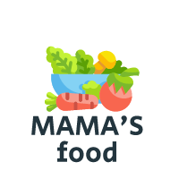

<div align="center">
  
  
  <br/>

</div>
<h1>MAMA'S FOOD</h1>
<a name="readme-top"></a>

# 📗 Table of Contents

- [📖 About the Project](#about-project)
  - [🛠 Built With](#built-with)
    - [Tech Stack](#tech-stack)
    - [Key Features](#key-features)
  - [🚀 Live Demo](#live-demo)
 - [💻 Getting Started](#getting-started)
  - [Setup](#setup)
  - [Prerequisites](#prerequisites)
  - [Install](#install)
  - [Usage](#usage)
  - [Run tests](#run-tests)

- [👥 Authors](#authors)
- [🔭 Future Features](#future-features)
- [🤝 Contributing](#contributing)
- [⭐️ Show your support](#support)
- [📝 License](#license)
- [🙏 Acknowledgements](#🙏-acknowledgments)


# 📖 [Portfolio] <a name="portfolio-setup"></a>

> This one is My first capstone project. In this project i am using html, css and javascript. I learned about linters and javascript dom manipulation.


## 🛠 Built With <a name="HTML & CSS"></a>
- ✅ HTML
- ✅ CSS
- ✅ JavaScript
- ✅ Styelint
- ✅ ESLint
- ✅ Git
- ✅ Github.
- ✅ Linters

### Tech Stack <a name="tech-stack"></a>

<details>
  <summary>Client</summary>
  <ul>
    <li><a href="https://html5.org/">HTML</a></li>
    <li><a href="https://css.org/">CSS</a></li>
    <li><a href="https://javascript.org"></a></li>
  </ul>
</details>


### Key Features <a name="key-features"></a>


- 🔰 [Home page]
 - 🔰 [About Page]
 - 🔰 [Menu Section]
 - 🔰 [Responsive]
-  🔰[MIT Liscence]

<p align="right">(<a href="#readme-top">back to top</a>)</p>

<!-- LIVE DEMO -->

## 🚀 Live Demo <a name="live-demo"></a>


- [Live Demo Link]()

<p align="right">(<a href="#readme-top">back to top</a>)</p>


## 💻 Getting Started <a name="getting-started"></a>


To get a local copy up and running, follow these steps.

### Prerequisites

In order to run this project you need:

. A code editor of your choice(like vs code or Atom and so on)
. Version control System (git is preferred)

### Setup

Clone this repository to your desired folder:
```
cd my-folder
git clone https://github.com/tajulafreen/portfolio.git
cd portfolio
```

### Install

Install this project with:
```
cd portfolio
npm i
```
### Usage

To run the project, execute the following command:


```sh
  live server
```


## 👥 Authors <a name="tajulafreen"></a>

👤 **AFREEN**

- GitHub: [@githubhandle](https://github.com/tajulafreen)
- Twitter: [@twitterhandle](https://twitter.com/tajulafreen)
- LinkedIn: [LinkedIn](https://www.linkedin.com/in/tajul-afreen-shaik-843951251/)


<p align="right">(<a href="#readme-top">back to top</a>)</p>


## 🔭 Future Features <a name="future-features"></a>


- [ ] **[sort]**
- [ ] **[microphone]**
- [ ] **[google-lens]**

<p align="right">(<a href="#readme-top">back to top</a>)</p>


## 🤝 Contributing <a name="contributing"></a>

Contributions, issues, and feature requests are welcome!

Feel free to check the [issues page](../../issues/).

<p align="right">(<a href="#readme-top">back to top</a>)</p>


## ⭐️ Show your support <a name="support"></a>

If you like this project don't forget to give stars.

<p align="right">(<a href="#readme-top">back to top</a>)</p>


## 📝 License <a name="license"></a>

This project is [MIT](./LICENSE) licensed.

## 🙏 Acknowledgments <a name="acknowledgements"></a>

-I would like to thank Microverse for the opportunity to work on this project.

-The Original design idea is by [Cindy Shin in Behance](https://www.behance.net/gallery/29845175/CC-Global-Summit-2015) Thanks to **Cindy Shin** for Creating such a beautiful design.

<p align="right">(<a href="#readme-top">back to top</a>)</p>